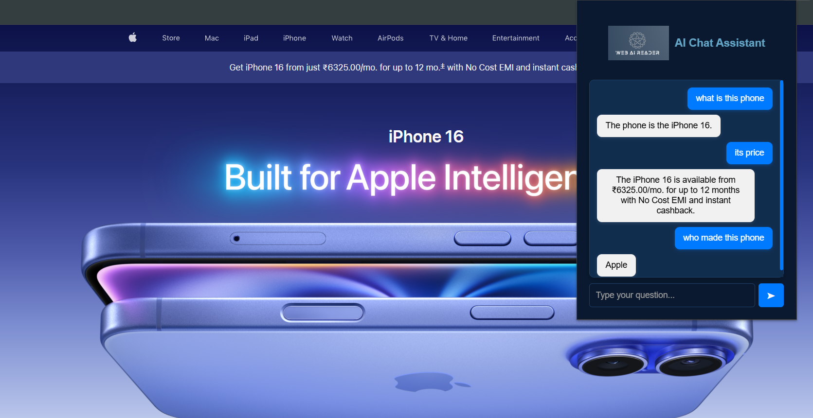
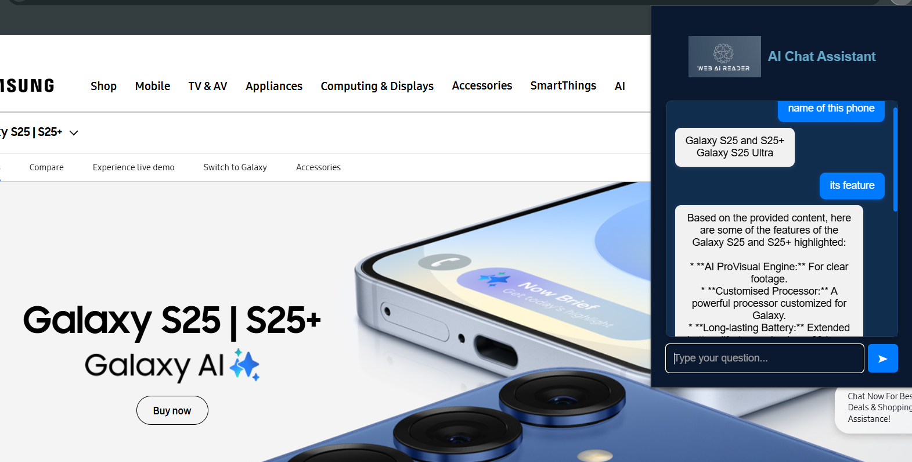

  <h1>🧠 AI Web Reader Chatbot Extension</h1>
  

  A Chrome Extension that scrapes webpage content and uses <strong>Google Gemini 2.0 Flash</strong> via <strong>LangChain</strong> to intelligently answer user questions based on the current page content.

  It supports smart webpage parsing using <code>BeautifulSoup</code>, <code>LangChain WebBaseLoader</code>, and <code>SeleniumURLLoader</code> — making it highly versatile for both static and JavaScript-heavy websites. Ideal for product pages, portfolio sites, news articles, blog summaries, and more.

  

  

https://github.com/user-attachments/assets/a9931e11-671e-4ec3-9354-cb091389fa0f

  <h2>📸 Demo Preview</h2>
  
  |  |  | 
  |---------------------------------|---------------------------------|  
  

  <h2>💡 Features</h2>
<ul>
  <li>✅ Chrome Extension UI</li>
  <li>✅ Scrapes and analyzes live webpage content using BeautifulSoup</li>
  <li>✅ Supports both static and dynamic pages via <code>WebBaseLoader</code> and <code>SeleniumURLLoader</code></li>
  <li>✅ Uses LangChain with <code>gemini-2.0-flash</code> for blazing fast, contextual responses</li>
  <li>✅ Answers questions intelligently based on current webpage context</li>
  <li>✅ Secure Gemini API key using <code>.env</code></li>
  <li>✅ Clean, modular Flask backend</li>
</ul>

  

  <h2>📁 Project Structure</h2>
  <pre><code>
AI_Web_Reader_Extension/
│
├── Backend/               # Flask API for Gemini
│   └── app.py             # Main backend logic
├── popup.html             # Extension popup UI
├── popup.js               # Frontend logic for chat
├── manifest.json          # Chrome Extension manifest
├── content.js             # content script
├── background.js          # background logic
├── .env                   # Contains API key (not pushed)
├── .gitignore             # Ignores venv, .env, logs
├── requirements.txt       # Python dependencies
└── README.md              # You're reading it!
  </code></pre>

  

  <h2>🚀 How to Run</h2>

  <h3>🧪 1. Backend Setup</h3>
  <pre><code>
git clone https://github.com/AbhaySingh71/AI-Web-Reader-Chatbot-Extention.git
cd AI-Web-Reader-Chatbot-Extention

# Create virtual environment
python -m venv venv
venv\Scripts\activate  # or source venv/bin/activate (Linux/mac)

# Install dependencies
pip install -r requirements.txt
  </code></pre>

  <h3>🔑 2. Create <code>.env</code> file</h3>
  <pre><code>
GOOGLE_API_KEY=your_gemini_api_key_here
USER_AGENT=ai-web-reader-bot
  </code></pre>

  
You can get your Gemini API key from: <a href="https://makersuite.google.com/app/apikey" target="_blank">https://makersuite.google.com/app/apikey</a>

  <h3>⚙️ 3. Run the Flask server</h3>
  <pre><code>python app.py</code></pre>

  <h3>🧩 4. Load Chrome Extension</h3>
  <ol>
    <li>Go to <code>chrome://extensions/</code></li>
    <li>Enable <strong>Developer Mode</strong></li>
    <li>Click <strong>Load Unpacked</strong></li>
    <li>Select your project folder</li>
  </ol>

  

  <h2>💻 Technologies Used</h2>
  <ul>
  <li>🧠 Google Gemini 2.0 Flash (via <code>google-generativeai</code>)</li>
  <li>🔗 LangChain</li>
  <li>🌐 BeautifulSoup</li>
  <li>🕹️ LangChain WebBaseLoader</li>
  <li>📸 LangChain SeleniumURLLoader</li>
  <li>🧪 Flask</li>
  <li>🎨 HTML, CSS, JavaScript (Chrome Extension)</li>
</ul>

  

  <h2>🔐 Security</h2>
  <ul>
    <li><code>.env</code> is <strong>not pushed to GitHub</strong></li>
    <li><code>venv/</code>, <code>.pyc</code>, and logs are <strong>ignored</strong></li>
    <li>Only <code>requirements.txt</code> is tracked for clean dependency install</li>
  </ul>

  

  <h2>📣 Credits</h2>

  Built with ❤️ by <a href="https://github.com/AbhaySingh71" target="_blank">Abhay Singh</a> 
  Powered by Google Gemini, LangChain

  

</body>
</html>
